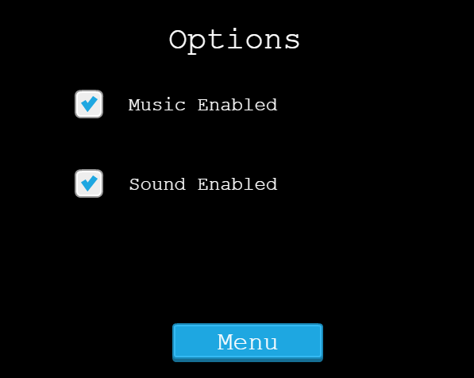

# LOTR Adventure - Phaser Game

> A RPG game built with Phaser 3. The mission of the warrior is to get the food to his twon, but several villains are lurking around.


## Built With

- JavaScript
- Phaser 3
- Tiled
- Webpack
- npm
- Firebase
- ESLint
- StyleLint
- Jest

## Video Presentation

[Presentation](https://www.loom.com/share/105757c0729b4d718b64e9ad82300db4)

## Live Demo

[Live Demo Link](https://javascript-capstone.web.app)

## Development Process

The first day I had to start investigating how to create video games with [Phaser 3](www.phaser.io), so I decided to follow this [tutorial](https://phaser.io/tutorials/making-your-first-phaser-3-game/part1). After that, I needed to create a more organized structure for my project. The structure I used is described in this [article](https://phasertutorials.com/creating-a-phaser-3-template-part-1/).

After finishing setting my initial project structure, I started reading about some basic [video games design principles](https://www.gamedesigning.org/learn/game-design-principles/), [mechanics](https://www.gamedesigning.org/learn/basic-game-mechanics/), and [level design](https://www.gamedesigning.org/learn/level-design/).

Having read the concepts necessary to create a video game, I picked my assets from [craftpix](www.craftpix.net) for the game tileset and used the [API](https://us-central1-js-capstone-backend.cloudfunctions.net/api/games) created by Microverse to save the players scores.

## Setup

First, clone or download the repo:

```
git clone https://github.com/abdelp/js-capstone.git
```

Inside the root folder, install the node packages:

```
npm i
```

## Potential Features

* Add more heroes and enemies.
* Add more action options, like different attacks.
* Add options to improve the attack, heal, like equip the warrior with armor, different kind of swords, arrows.
* Make it more interactive, add more dialogs.

### Prerequisites

- npm 6.14.5


### Usage

Inside the root folder run the watch command:

```
npm run server
```

By default, the game will be deployed on port 8080 of your localhost:

```
http://localhost:8080
```

### How to play

* In the main manu, click on "Play" button


* After that, you need to enter the name for the player


* To move the player, you can use the arrow keys (🡡 up, 🡣 down, 🡠 left, right 🡢)

* You need to collect the three food baskets distributed in the map


* After you collect the three food baskets, the Game Finished screen is displayed and your name in the leaderboard if your are in the top 10 players with highest scores.

## To fight

When you find a hidden enemy, a battle scenario is displayed


* The item to be selected is highlighted in yellow
* To select the item and pass to the next menu you can press the Space or Enter key. The first menu is to select the warrior, the second to select between the attack the enemy or heal, you can heal just twice in all the game, so be careful when you are going to do it. And the third menu is to select the enemy to attack.
* If you defeat the enemy, you return to the world, to continue searching the food. If you lose, the Game Over screen is displayed.

## Options

You can turn on/off the music and sound of the game in the options menu:



### Run tests

To run the tests, go to the root folder of the project and run:

```
npm run test
```

## Author

👤 **Abdel Pérez**

- GitHub: [@AbdelP](https://github.com/AbdelP)
- Twitter: [@AbdelPerez11](https://twitter.com/AbdelPerez11)
- LinkedIn: [abdel-perez](https://linkedin.com/in/abdel-perez)


## 🤝 Contributing

Contributions, issues, and feature requests are welcome!

Feel free to check the [issues page](issues/).

## Show your support

Give a ⭐️ if you like this project!

## Acknowledgments

- Microverse Inc.
- Inspiration [ZENVA Academy](https://academy.zenva.com/)

## 📝 License

This project is [MIT](lic.url) licensed.