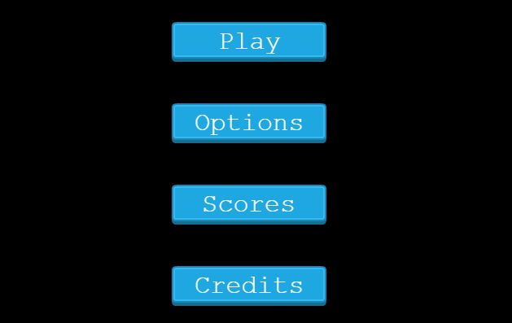
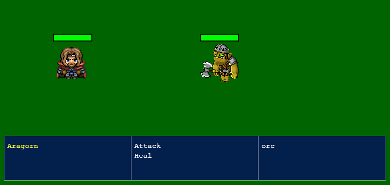

# LOTR Adventure - Phaser Game

> A RPG game built with Phaser 3. The mission of the warrior is to get the food to his twon, but several villains are lurking around.


## Built With

- JavaScript
- Phaser 3
- Tiled
- Webpack
- npm
- Firebase
- ESLint
- StyleLint
- Jest

## Live Demo

[Live Demo Link](https://javascript-capstone.web.app)


## Getting Started

First, clone or download the repo:

```
git clone https://github.com/abdelp/js-capstone.git
```

Inside the root folder, install the node packages:

```
npm i
```

### Prerequisites

- npm 6.14.5


### Usage

Inside the root folder run the watch command:

```
npm run server
```

By default, the game will be deployed on port 8080 of your localhost:

```
http://localhost:8080
```

### How to play

* In the main manu, click on "Play" button



* After that, you need to enter the name for the player


* To move the player, you can use the arrow keys (🡡 up, 🡣 down, 🡠 left, right 🡢)

* You need to collect the three food baskets distributed in the map


## To fight

When you find a hidden enemy, a battle scenario is displayed



* The item to be selected is highlighted in yellow
* To select the item and pass to the next menu you can press the Space or Enter key. The first menu is to select the warrior, the second to select between the attack the enemy or heal, you can heal just twice in all the game, so be careful when you are going to do it. And the third menu is to select the enemy to attack.
* If you defeat the enemy, you return to the world, to continue searching the food. If you lose, the Game Over screen is displayed.

### Run tests

To run the tests, go to the root folder of the project and run:

```
npm run test
```

### Deployment


## Authors

👤 **Abdel Pérez**

- GitHub: [@githubhandle](https://github.com/AbdelP)
- Twitter: [@twitterhandle](https://twitter.com/AbdelPerez11)
- LinkedIn: [LinkedIn](https://linkedin.com/in/abdel-perez)


## 🤝 Contributing

Contributions, issues, and feature requests are welcome!

Feel free to check the [issues page](issues/).

## Show your support

Give a ⭐️ if you like this project!

## Acknowledgments

- Microverse Inc.
- Inspiration [ZENVA Academy](https://academy.zenva.com/)

## 📝 License

This project is [MIT](lic.url) licensed.